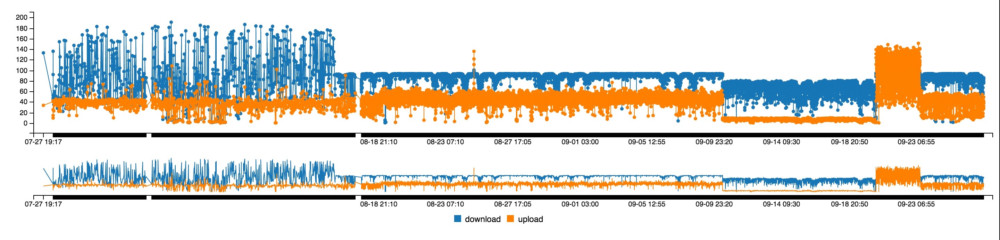

# Network Perforamance Visualization

Plots the performance of network by plotting crons for speed test, ping test and git pull test.

## Description

*Scripts* folder consists of python script `LogDateSpeed.py`  which needs to run in git repository as a cronjob to create `SpeedTimeLog.csv`.  
[Speed test](https://github.com/sam17/speedtest-cli) consists of the python scripts for speed test and logging in a csv.  

Both the CSVs are post processed by the `javascript` scripts running on a `SimpleHTTPServer` to plot the graphs.

## Visualisation
  
Net Speed Visualization  

  
Git Pull Speed Visualization

